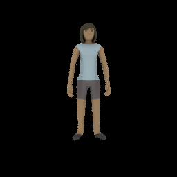
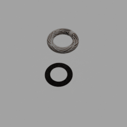

# Video based reconstruction dataset

This dataset mainly challenges the monnocular video based 3D reconstruction methods, such as [LASR](https://github.com/google/lasr). The dataset includes rigid objects from ShapeNet and non-rigid human animations built from [quaternius](https://quaternius.com).





# Quick Start

To generate a car dataset, run the following:

```
docker run --rm --interactive \
  --user $(id -u):$(id -g)    \
  --volume "$(pwd):/kubric"   \
  kubricdockerhub/kubruntu    \
  /usr/bin/python3 challenges/video_based_reconstruction/worker.py \
  --object=car                \
```

Script parameters include:
- `rotate_camera`: bool, whether to rotate camera during simulation. If enabled, camera will rotate vertically around world center.
- `camera_rot_range`: radius angle for which the camera will rotate.
- `object`: one of [cube, torus, car, airplane, chair, table, pillow]
- `extra_obj_texture`: whether to apply external texture on the object
- `obj_texture_path`: path to the external texture
- `no_texture`: whether to remove all texture, including original texture for ShapeNet objects

## Output Format

The script is configured to directly output data in format of LASR input. A folder with name `object` is created in `output` directory.
- `<object>/FlowBW`, `<object>/FlowFW`: backward and forward optical flow images
- `<object>/LASR/Annotations/Full-Resolution/(r)<object>`: object masks
- `<object>/LASR/Camera/Full-Resolution/(r)<object>`: camera extrinsics in LASR's preferred format. Please refer to `<object>/metadata.json` for more readable camera parameters
- `<object>/LASR/JPEGImages/Full-Resolution/(r)<object>`: object images